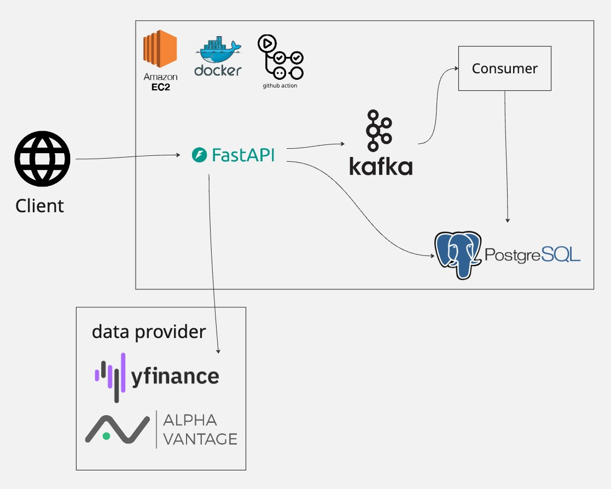

# Market Data Service

This is a FastAPI-based market data service that fetches real-time and historical market data from various providers, stores it, and makes it available through a RESTful API. The service is designed to be extensible, allowing for the addition of new data providers and data processing capabilities.




## Features

- **Real-time Price Fetching**: Get the latest market prices for specified symbols.
- **Data Persistence**: Raw price data is stored in a database for historical analysis.
- **Asynchronous Polling**: A scheduler periodically fetches data from providers.
- **Event-driven Architecture**: Price updates are published to a Kafka topic for real-time consumption by other services.
- **Extensible Provider System**: Easily add new data sources by implementing a common interface.
- **Moving Average Calculation**: Provides an endpoint to calculate and store moving averages.

## Tech Stack

- **Backend**: Python, FastAPI
- **Database**: SQLAlchemy with an async driver (e.g., `asyncpg` for PostgreSQL)
- **Messaging**: Kafka
- **Scheduling**: APScheduler
- **Containerization**: Docker, Docker Compose

## Project Structure

```
market-data-service/
├── app/
│   ├── api/          # FastAPI routers and endpoints
│   ├── core/         # Core logic, including scheduling and calculations
│   ├── db/           # Database models and session management
│   ├── kafka/        # Kafka producer and consumer logic
│   ├── providers/    # Data provider implementations
│   └── main.py       # FastAPI application entry point
├── .github/
│   └── workflows/
│       └── deploy.yml  # GitHub Actions CI/CD workflow
├── docker-compose.yml # Docker Compose for production
├── docker-compose.dev.yml # Docker Compose for development
├── Dockerfile        # Dockerfile for the application
└── requirements.txt  # Python dependencies
```

## Getting Started

### Prerequisites

- Docker and Docker Compose
- Python 3.9+

### Installation

1.  **Clone the repository:**

    ```bash
    git clone https://your-repository-url.git
    cd market-data-service
    ```

2.  **Set up environment variables:**

    Create a `.env` file in the root of the `market-data-service` directory. You can copy the example:

    ```bash
    cp .env.example .env
    ```

    Update the `.env` file with your database and Kafka configurations.

3.  **Build and run with Docker Compose:**

    For development:

    ```bash
    docker-compose -f docker-compose.dev.yml up --build
    ```

    For production:

    ```bash
    docker-compose up --build
    ```

The application will be available at `http://localhost:8000`.

## API Endpoints

-   `GET /health`: Health check for the service.
-   `GET /prices/latest?symbol=<symbol>`: Get the latest price for a symbol.
-   `POST /poll/{symbol}`: Trigger a manual poll for a symbol.
-   `GET /ma/{symbol}`: Get the moving average for a symbol.

```
curl http://<ip>:8000/prices/latest\?symbol\=CRM

curl -X POST http://<ip>:8000/prices/poll \
  -H "Content-Type: application/json" \
  -d '{"symbols": ["AAPL", "MSFT"], "interval": 60, "provider": "yfinance"}
  '
curl "http://<ip>:8000/prices/ma?symbol=TSLA&window=5"
```


## CI/CD

This project uses GitHub Actions for continuous integration and deployment to an AWS EC2 instance.

The workflow is defined in `.github/workflows/deploy.yml` and performs the following steps:

1.  **On Push to `main`**: The workflow is triggered automatically on every push to the `main` branch.
2.  **Build and Push Docker Image**: A new Docker image for the service is built and pushed to Docker Hub.
3.  **Deploy to EC2**:
    -   The workflow securely connects to the EC2 instance using an SSH key.
    -   It pulls the latest version of the code from the `main` branch.
    -   It creates a `.env` file on the EC2 instance using secrets stored in the GitHub repository.
    -   It uses `docker-compose` to pull the new image and restart the services.

### Repository Secrets

The following secrets must be configured in the GitHub repository settings for the CI/CD pipeline to work:

-   `DOCKER_USERNAME`: Your Docker Hub username.
-   `DOCKER_PASSWORD`: Your Docker Hub password or access token.
-   `EC2_HOST`: The IP address or DNS name of your EC2 instance.
-   `EC2_USER`: The username for connecting to your EC2 instance (e.g., `ubuntu`).
-   `EC2_SSH_KEY`: The private SSH key for accessing your EC2 instance.
-   `POSTGRES_DB`: The name of the PostgreSQL database.
-   `POSTGRES_USER`: The PostgreSQL username.
-   `POSTGRES_PASSWORD`: The PostgreSQL password.
-   `ALPHA_VANTAGE_API_KEY`: Your API key for Alpha Vantage.
-   `KAFKA_BOOTSTRAP_SERVERS`: The address of your Kafka brokers.
-   `DATABASE_URL`: The full database connection string.


## How to Extend

### Adding a New Data Provider

1.  Create a new file in `app/providers/` (e.g., `app/providers/my_provider.py`).
2.  Implement the `PriceProvider` interface from `app/providers/base.py`.
3.  Update the `provider_map` in `app/providers/__init__.py` to include your new provider.

## Contributing

Contributions are welcome! Please feel free to submit a pull request. 